# La Dolce Vita – Italian Restaurant & Wine Boutique Website

## Student Information
- **Name:** Emmanuella Akanda 
- Student ID: 22743/2023 
- **Program:** Computing and Information Sciences  
- **Institution:** UNILAK  
- **Course:** Software Engineering / No-Code E-Commerce Project  

## Project Title
**La Dolce Vita – Italian Restaurant & Wine Boutique**

## Project Description
La Dolce Vita is a modern Italian restaurant and wine boutique website created using Wix. The website was designed to provide customers with an elegant online experience where they can discover authentic Italian cuisine, explore the restaurant menu, learn about the story of the restaurant, and interact with the online cart system.

The restaurant was founded by an Italian owner passionate about traditional recipes, homemade flavors, and fine wines. Inspired by Italian family culture, the website reflects warmth, authenticity, and hospitality.

## Platform Used
- Wix Website Builder  
- GitHub  

## Features Implemented
- Homepage with welcome message and restaurant introduction  
- Product/Menu page with Italian dishes and prices  
- About page describing the restaurant story and mission  
- Contact page with contact form, email, and phone number  
- Shopping cart interaction using Wix Store  
- Wine boutique presentation  
- Responsive and modern design  
- Online reservation section  

## Pages Included
1. Homepage  
2. Menu/Product Page  
3. About Page /our story 
4. Contact Page  

  

## Technologies & Tools
- Wix    
- GitHub  

## Screenshots

### Homepage
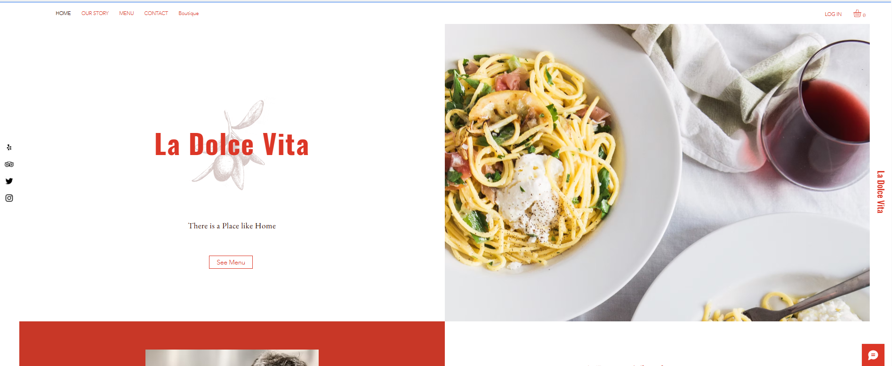
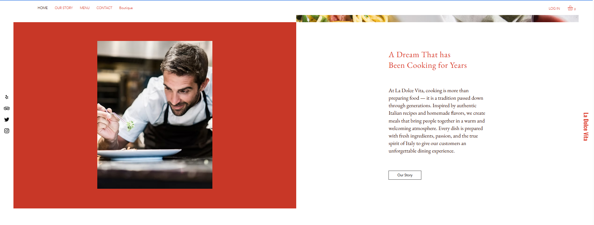
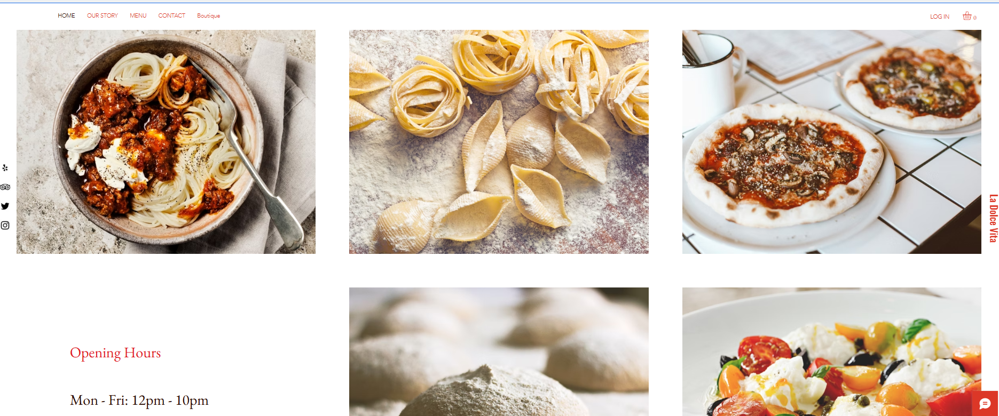
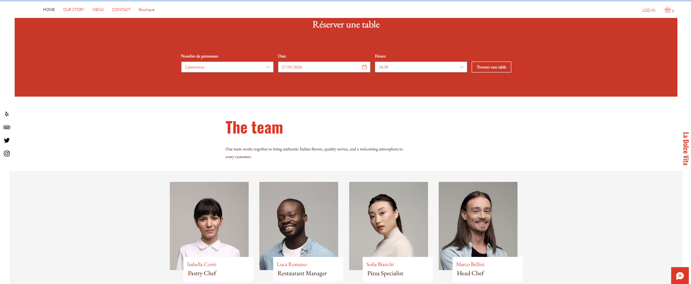
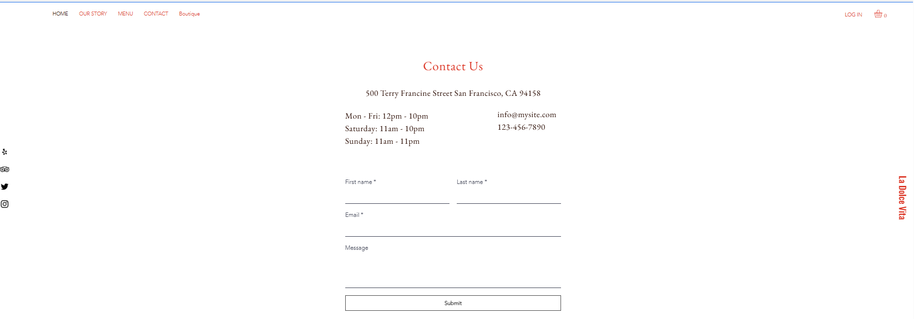
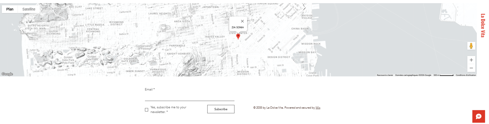

### Menu Page
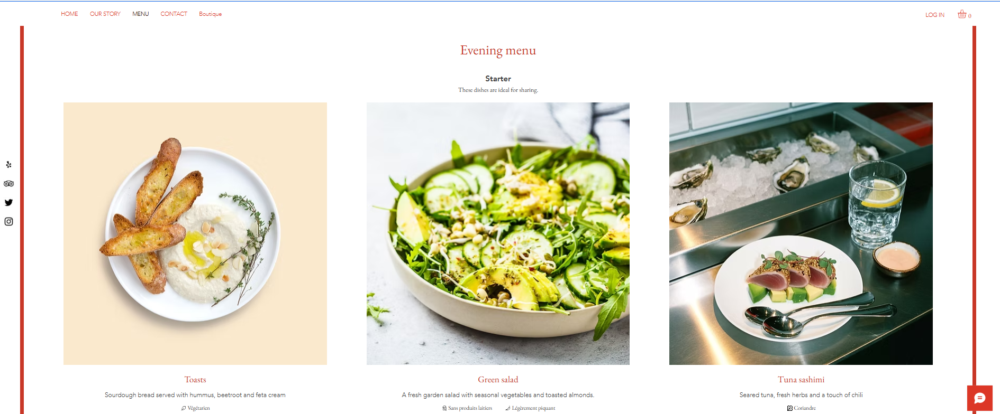
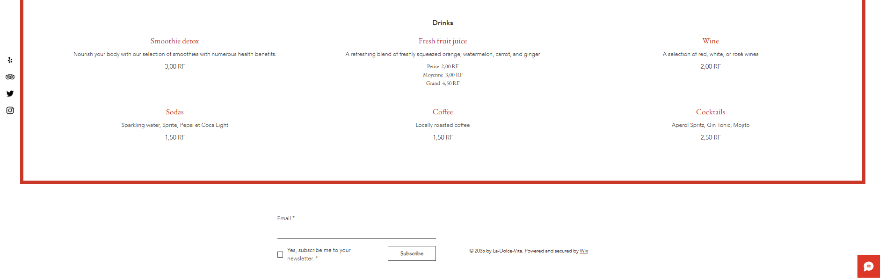
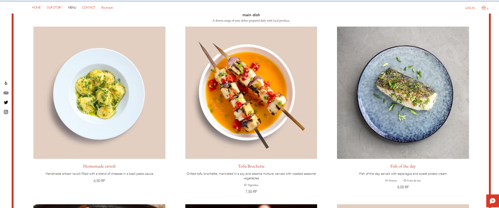

### About Page
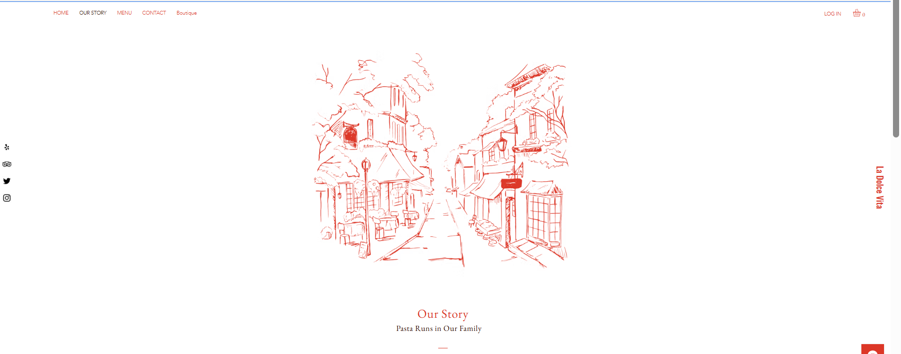
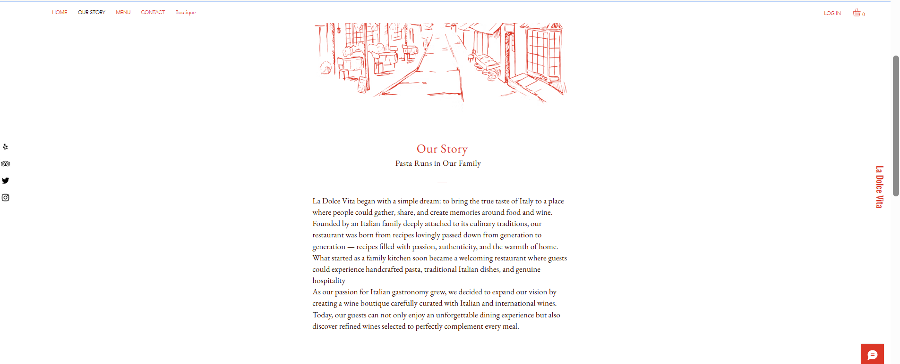

### Contact Page

### Boutique
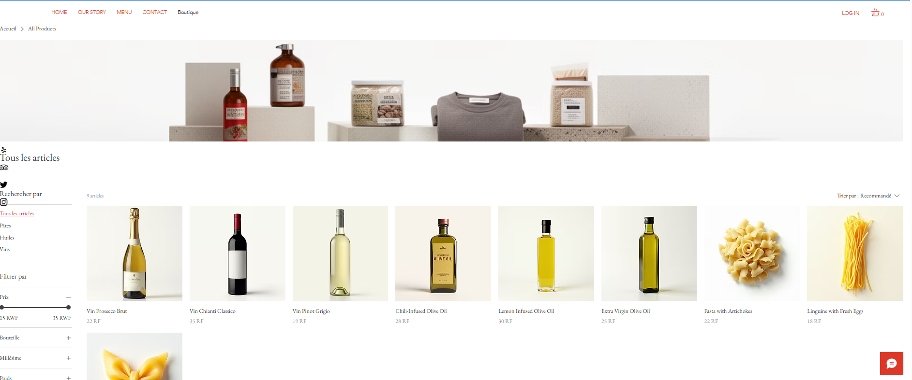

## Challenges Faced
- Choosing and customizing the right Wix template  
- Translating some parts of the website from French to English  
- Organizing the restaurant menu and wine boutique sections  
- Creating a clean and professional layout  
- Managing images and responsive design  

## Lessons Learned
Through this project, I learned:
- How to design a no-code e-commerce website using Wix  
- How to customize templates and website sections  
- How to manage pages, menus, and products  
- Basic UI/UX and web design principles  
- How to document a project using GitHub and Markdown  

## Live Website Link
https://akandaemmanuella.wixsite.com/la-dolce-vita

## GitHub Repository Link
https://github.com/emma159-code/italian-restaurant-site

